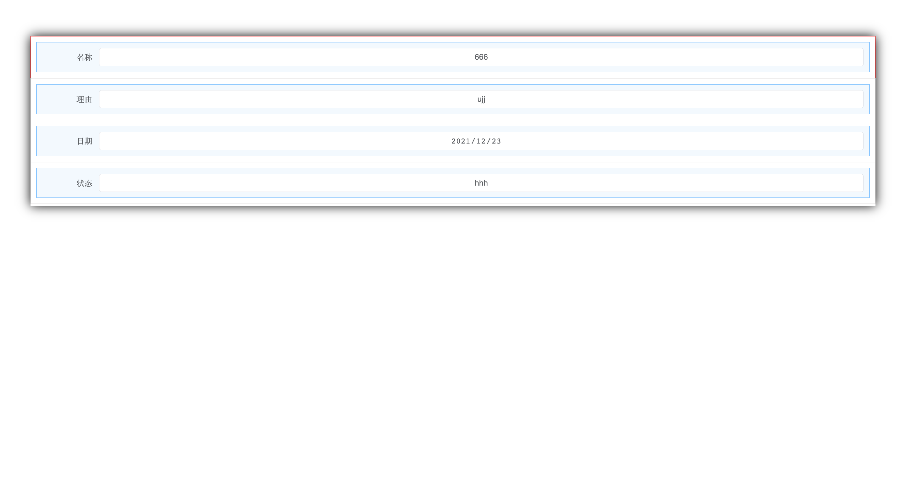

## 项目说明

> 这是一个基于自建前端框架TypeDom创建的动态表单项目。

## 项目环境

> 1、全局和本地安装TypeScript

> 2、初始化、安装webpack、webpack-cli、webpack-dev-server、webpack-merge

> 3、两个webpack插件clean-webpack-plugin和html-webpack-plugin

> 4、创建配置文件tsconfig.json, tsc --init

> 5、安装loader， ts-loader css-loader url-loader file-loader less-loader

> 6、单元测试npx ts-jest config:init

## 项目运行

> 1、安装环境：yarn install

> 2、运行项目： yarn serve

> 3、生成js版本项目代码: yarn js

> 4、打包项目： yarn build

> 5、生成库： yarn lib

> 6、生成类图： yarn uml

> 7、生成文档：yarn docs

> 8、代码检查：yarn ts-coverage

## 框架介绍

    1、技术栈
        –	虚拟DOM：TypeNode
        –	webpack
        –	typescript
        –	抽象类
        –	实体类
        –	rxjs
    2、项目结构
        –	build
        –	public
        –	src
            –	assets
            –	core:
                –	controls
                –	document
                –	menus
                –	page
            –	views 页面布局
            –	style
        –	type-node 依赖基础库
        –	test

## 添加控件的过程

> 1、首先添加对应的ControlItem

> 2、添加控件

> 3、添加控件菜单

## 设计表单模式和填表模式及只读表单模式的地址(webpack.base.config.js中有配置)

> 1、http://localhost:8118/example-design-mode.html 设计表单模式示例

> 2、http://localhost:8118/example-fill-mode.html 填表模式示例

> 3、http://localhost:8118/example-readonly-mode.html 只读表单模式示例

## onChange 监听写法

    // control 是回调过来的当前选中的控件
    // control.parent ----> 页面，包含了所有的控件
    // control.index ----> 控件在页面中的排序
    // resetInputValue ----> 控件本身提供的修改input内容的方法。
    function(control) {
        console.log('control is ', control)
        control.parent.childNodes[control.index - 1].resetInputValue(control.formItem.itemContent.dom.value);
    }

## 配置控件字段

        对应FormEditor类中的方法 setControlFieldConfig(config: IOptionConfig)

## 公式

        变量 formulaVisible， 控制公式编辑器是否显示。在表单编辑器中点击后，其值变为true。
            formulaVisibleObservable, 默认值的 ... 按钮的监听事件。回调即可监听。
            如 this.editor.formulaVisibleObservable.subscribe((e) => {
                    // 监听的代码
                }
        所以，关闭公式编辑器时，要赋值为 false；
        方法 setControlDefaultValueFormula(formula: string) ,传参设置公式字符串。设置后，公式将挂接在控件的属性formula上。

## 控件选项列表

        变量： optionsConfigObservable， 这是对选项类别属性的 ... 的按钮的监听事件。回调即可监听。代码如上面的公式的监听回调。
        方法： setControlOptionConfig(config: IOptionConfig)。项目向编辑器中传参。

## 关联选项设置监听和赋值方法

        变量： connectionObservable,调用方式同上选项列表。
        方法： setControlConnection(label: string, value: string)，设置关联选项属性的值。

## 关联选项的点击事件监听，和赋值方法

        变量： connectionItemObservable, 点击关联选项控件时，监听选中的控件的connectionItemObservable.
            使用时，需要先判断 editor.connectionObservable是否为空，然后再订阅监听。要在相应的事件中添加订阅，而不是加载时。
            因为加载时，默认选中的控件是空的，connectionItemObservable也是空的。
            在编辑器点击事件中监听。
            editor.editorElObservable.subscribe(() => {
                editor.connectionItemObservable.subscribe(() => {
                    console.log('editor.connectionItemObservable ...')
                }
            }
        方法： setConnectionItemValue(label: string, value: string),设置关联选项控件的值。

## 附件控件添加附件的监听

        变量： attachmentObservable,点击附件控件，选择文件的监听。
            使用时，同上
            editor.editorElObservable.subscribe(() => {
                editor.attachmentObservable.subscribe(() => {
                    console.log('editor.attachmentObservable ...')
                }
            }
        方法：setAttachmentValue(value: string)

        使用样例： example-design-mdoe.ts initEvents方法中

## 提交表单

        变量： submitObservable, 提交的监听事件。
              formData 表单数据，结构 { 字段名：字段值， }

## 重置optionConfig

        变量： optionControls, 所有带有optionConfig配置的控件。
            重置需要，循环遍历控件，然后，给需要重置的控件重新设置optionConfig.
            control.optionConfig = config(组装后的需要config)
            control.formItem.setItemContent(config);

## 传入的外部函数

        变量： editor.functionMap，这是一个 Map。
            设置函数  editor.functionMap.set(functionName, function)
            获取函数  editor.functionMap.get(functionName);就能获取外部的函数。
            在 onChange中调用时， 将函数包含在 {{}}中，解析onChange对应的函数字符串时，能将之解析出来，对应到设置的函数。
            在vue中定义的函数
            function add(a, b) {
                return a + b;
            }
            在 onChange中调用
            function(ctrl, funMap) {
                let sum = funMap.get('add')(1, 2)
                console.log('sum is ', sum)
            }
        例子： example-design-mode.ts 中

## 几个公共变量

        selectedControl : 当前选中的控件
        selectedMenu: 当前选中的控件菜单按钮
        selectedTableDataCell: 当前选中的表格的单元格
        formData: 提交的数据
        allControls: 表单的所有控件
        optionControls: 带有optionConfig属性的控件
        currentPage: 当前页面
        defaultPage: 默认页面
        form: 填表模式和只读模式下表单层

        
## 注

> 1、在constructor构造函数中，不要用 setStyle,setAttrObj,appendChild等带有渲染的方法。

> 2、在实体类的构造函数中，如果没有特殊属性，不需要单独定义propObj,events；在 web-element中赋值了。

> 3、构造函数的parent参数，直接用 public parent；

> 4、全局的样式，要用自定义的常量，以便全局修改；

